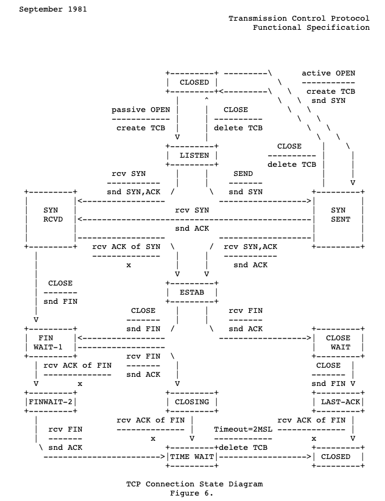
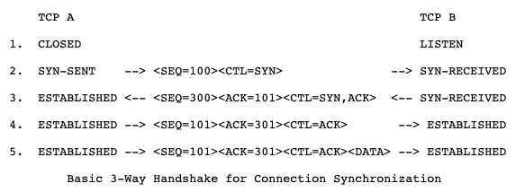
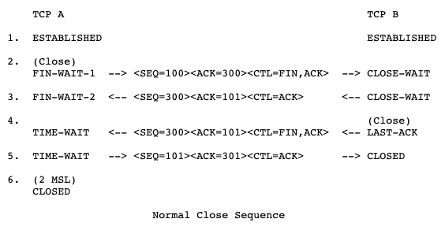

## TCP

### 报文格式

### 11种状态切换

### 建立连接三次握手过程

### 关闭连接四次挥手过程

### 可靠
### 大文件分配传输
### 参考
[TCP rfc](https://tools.ietf.org/html/rfc793#page-15)

## DNS
1. dns与解析
2. 查浏览器缓存
3. 查本机host文件
4. 查最近的域名解析服务器
5. 向上查域名解析服务器

## CDN
1. CDN (Content Delivery Network)内容分发网路。CDN是构建在现有网络基础之上的智能虚拟网络，依靠部署在各地的边缘服务器，通过中心平台的负载均衡、内容分发、调度等功能模块，使用户就近获取所需内容，降低网络拥塞，提高用户访问响应速度和命中率。CDN的关键技术主要有内容存储和分发技术。
2. 特点：
- 分布式，内容分发就近选择，减少服务器压力
- 降低网络拥塞
- 提高响应速度和命中率

- 参考
  [CDN](https://baike.baidu.com/item/CDN)
  [知乎 CDN](https://www.zhihu.com/question/36514327/answer/1604554133)

## 网络安全
### redos攻击
/(a+)+z/.test('aaaaaaaaaaaaaaaaaaaaaaaaaaaaaaab');
