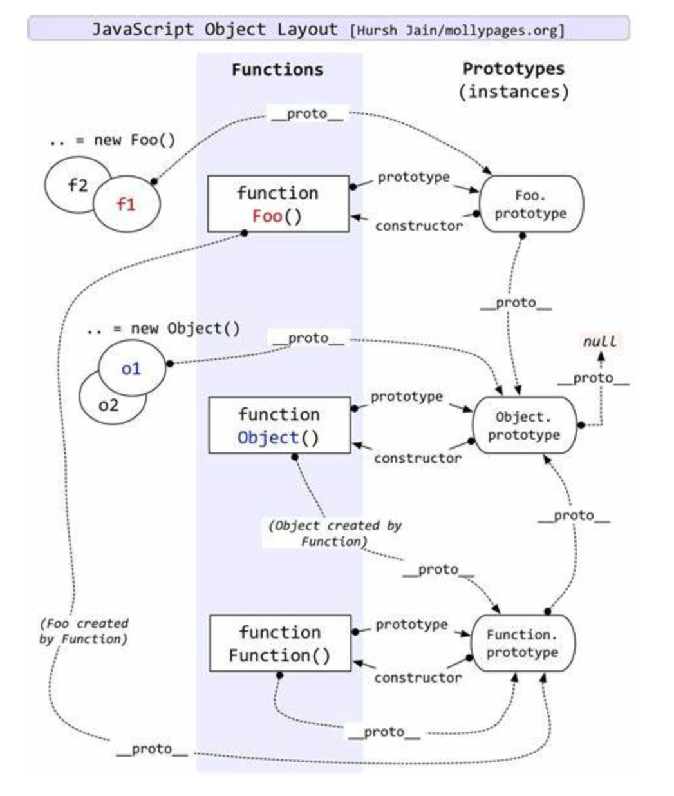

# 原型链

  


- 事件循环过程

  1.先执行同步代码

  2.执行完所有的微任务

  3.执行一个宏任务

  ```javascript
  setTimeout(()=>{
      console.log('macrotask')
  },0);
  
  queueMicrotask(() => {
    /* 微任务中将运行的代码 */
    console.log('microTask1')
  });
  
  queueMicrotask(() => {
    /* 微任务中将运行的代码 */
    console.log('microTask2')
  });
  console.log('synchronize')
  //输出结果
  // synchronize
  // microTask1
  // microTask2
  // macrotask
  ```

- 事件循环六个阶段

 

- 参考

  [node事件循环](https://nodejs.org/zh-cn/docs/guides/event-loop-timers-and-nexttick/#what-is-the-event-loop)

  [深入理解js事件循环机制（Node.js篇）](http://lynnelv.github.io/js-event-loop-nodejs)

  [nodejs中的event loop](https://www.jianshu.com/p/deedcbf68880)
