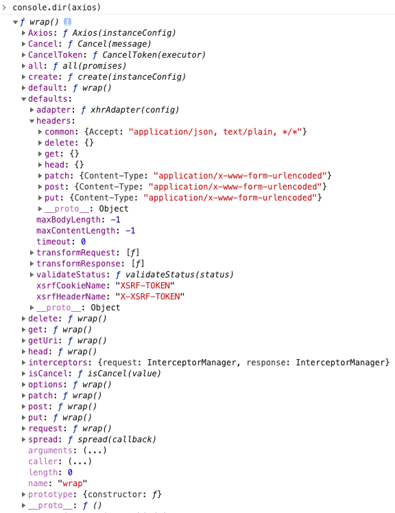
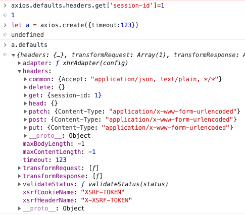

# axios

## 定位
Promise based HTTP client for the browser and node.js
基于Promise的httpClient兼容浏览器和node


## 特性
- 支持promise
- 同构代码（跨端） 浏览器上基于XMLHttpRequest  node上基于http
- 请求响应拦截器(洋葱模型)
- 支持防XSRF攻击
- 取消请求



## 洋葱模型

请求拦截器 -> 发请求 -> 响应拦截器

注意请求拦截器和响应拦截器都是数组

## axios请求图片

- 要加上responseType: 'arraybuffer'
```js
let res = await axios.post(`https://api.weixin.qq.com/cgi-bin/wxaapp/createwxaqrcode?access_token=${access_token}`, {
  'path': 'page/index/index',
  'width': 430
}, {
  responseType: 'arraybuffer'
});
response.setHeader('content-type',res.headers['content-type'])
response.send(res.data)
response.end();
```

## 全部配置axios.defaults
- axios.defaults保存axios的全局配置
- axios.get、post等方法会使用axios的全局配置
- axios.create创建axios实例会使用全部配置
  
- axios.default是为了在ts中兼容默认导入
```js
// Allow use of default import syntax in TypeScript
module.exports.default = axios;
```
## axios对象
- axios对象不是Axios实例
```js
/**
 * Create an instance of Axios
 *
 * @param {Object} defaultConfig The default config for the instance
 * @return {Axios} A new instance of Axios
 */
function createInstance(defaultConfig) {
  var context = new Axios(defaultConfig);
  var instance = bind(Axios.prototype.request, context);

  // Copy axios.prototype to instance
  utils.extend(instance, Axios.prototype, context);

  // Copy context to instance
  utils.extend(instance, context);

  return instance;
}

var axios = createInstance(defaults);
```

## axios适配器
```js
// 浏览器使用XMLHttpRequest node使用http
function getDefaultAdapter() {
  var adapter;
  if (typeof XMLHttpRequest !== 'undefined') {
    // For browsers use XHR adapter
    adapter = require('./adapters/xhr');
  } else if (typeof process !== 'undefined' && Object.prototype.toString.call(process) === '[object process]') {
    // For node use HTTP adapter
    adapter = require('./adapters/http');
  }
  return adapter;
}
```
## axios方法
- delete、get、head、options没有body参数
- post、put、patch可以携带body参数
- 参考[axios.delete发body参数issue](https://github.com/axios/axios/issues/3292)
```js
// Provide aliases for supported request methods
utils.forEach(['delete', 'get', 'head', 'options'], function forEachMethodNoData(method) {
  /*eslint func-names:0*/
  Axios.prototype[method] = function(url, config) {
    return this.request(mergeConfig(config || {}, {
      method: method,
      url: url,
      data: (config || {}).data
    }));
  };
});

utils.forEach(['post', 'put', 'patch'], function forEachMethodWithData(method) {
  /*eslint func-names:0*/
  Axios.prototype[method] = function(url, data, config) {
    return this.request(mergeConfig(config || {}, {
      method: method,
      url: url,
      data: data
    }));
  };
});
// axios delete发送body参数
axios.request({ method: 'delete', url, data })
```

## 核心函数

### 浏览器端

```js
// XMLHttpRequest封装
module.exports = function xhrAdapter(config) {
  return new Promise(function dispatchXhrRequest(resolve, reject) {
    var requestData = config.data;
    var requestHeaders = config.headers;

    if (utils.isFormData(requestData)) {
      delete requestHeaders['Content-Type']; // Let the browser set it
    }

    var request = new XMLHttpRequest();

    // HTTP basic authentication
    if (config.auth) {
      var username = config.auth.username || '';
      var password = config.auth.password ? unescape(encodeURIComponent(config.auth.password)) : '';
      requestHeaders.Authorization = 'Basic ' + btoa(username + ':' + password);
    }

    var fullPath = buildFullPath(config.baseURL, config.url);
    request.open(config.method.toUpperCase(), buildURL(fullPath, config.params, config.paramsSerializer), true);

    // Set the request timeout in MS
    request.timeout = config.timeout;

    // Listen for ready state
    request.onreadystatechange = function handleLoad() {
      if (!request || request.readyState !== 4) {
        return;
      }

      // The request errored out and we didn't get a response, this will be
      // handled by onerror instead
      // With one exception: request that using file: protocol, most browsers
      // will return status as 0 even though it's a successful request
      if (request.status === 0 && !(request.responseURL && request.responseURL.indexOf('file:') === 0)) {
        return;
      }

      // Prepare the response
      var responseHeaders = 'getAllResponseHeaders' in request ? parseHeaders(request.getAllResponseHeaders()) : null;
      var responseData = !config.responseType || config.responseType === 'text' ? request.responseText : request.response;
      var response = {
        data: responseData,
        status: request.status,
        statusText: request.statusText,
        headers: responseHeaders,
        config: config,
        request: request
      };

      settle(resolve, reject, response);

      // Clean up request
      request = null;
    };

    // Handle browser request cancellation (as opposed to a manual cancellation)
    request.onabort = function handleAbort() {
      if (!request) {
        return;
      }

      reject(createError('Request aborted', config, 'ECONNABORTED', request));

      // Clean up request
      request = null;
    };

    // Handle low level network errors
    request.onerror = function handleError() {
      // Real errors are hidden from us by the browser
      // onerror should only fire if it's a network error
      reject(createError('Network Error', config, null, request));

      // Clean up request
      request = null;
    };

    // Handle timeout
    request.ontimeout = function handleTimeout() {
      var timeoutErrorMessage = 'timeout of ' + config.timeout + 'ms exceeded';
      if (config.timeoutErrorMessage) {
        timeoutErrorMessage = config.timeoutErrorMessage;
      }
      reject(createError(timeoutErrorMessage, config, 'ECONNABORTED',
        request));

      // Clean up request
      request = null;
    };

    // Add xsrf header
    // This is only done if running in a standard browser environment.
    // Specifically not if we're in a web worker, or react-native.
    if (utils.isStandardBrowserEnv()) {
      // Add xsrf header
      var xsrfValue = (config.withCredentials || isURLSameOrigin(fullPath)) && config.xsrfCookieName ?
        cookies.read(config.xsrfCookieName) :
        undefined;

      if (xsrfValue) {
        requestHeaders[config.xsrfHeaderName] = xsrfValue;
      }
    }

    // Add headers to the request
    if ('setRequestHeader' in request) {
      utils.forEach(requestHeaders, function setRequestHeader(val, key) {
        if (typeof requestData === 'undefined' && key.toLowerCase() === 'content-type') {
          // Remove Content-Type if data is undefined
          delete requestHeaders[key];
        } else {
          // Otherwise add header to the request
          request.setRequestHeader(key, val);
        }
      });
    }

    // Add withCredentials to request if needed
    if (!utils.isUndefined(config.withCredentials)) {
      request.withCredentials = !!config.withCredentials;
    }

    // Add responseType to request if needed
    if (config.responseType) {
      try {
        request.responseType = config.responseType;
      } catch (e) {
        // Expected DOMException thrown by browsers not compatible XMLHttpRequest Level 2.
        // But, this can be suppressed for 'json' type as it can be parsed by default 'transformResponse' function.
        if (config.responseType !== 'json') {
          throw e;
        }
      }
    }

    // Handle progress if needed
    if (typeof config.onDownloadProgress === 'function') {
      request.addEventListener('progress', config.onDownloadProgress);
    }

    // Not all browsers support upload events
    if (typeof config.onUploadProgress === 'function' && request.upload) {
      request.upload.addEventListener('progress', config.onUploadProgress);
    }

    if (config.cancelToken) {
      // Handle cancellation
      config.cancelToken.promise.then(function onCanceled(cancel) {
        if (!request) {
          return;
        }

        request.abort();
        reject(cancel);
        // Clean up request
        request = null;
      });
    }

    if (!requestData) {
      requestData = null;
    }

    // Send the request
    request.send(requestData);
  });
};
```
### node端

```js
//http封装
module.exports = function httpAdapter(config) {
  return new Promise(function dispatchHttpRequest(resolvePromise, rejectPromise) {
    var resolve = function resolve(value) {
      resolvePromise(value);
    };
    var reject = function reject(value) {
      rejectPromise(value);
    };
    var data = config.data;
    var headers = config.headers;

    // Set User-Agent (required by some servers)
    // Only set header if it hasn't been set in config
    // See https://github.com/axios/axios/issues/69
    if (!headers['User-Agent'] && !headers['user-agent']) {
      headers['User-Agent'] = 'axios/' + pkg.version;
    }

    if (data && !utils.isStream(data)) {
      if (Buffer.isBuffer(data)) {
        // Nothing to do...
      } else if (utils.isArrayBuffer(data)) {
        data = Buffer.from(new Uint8Array(data));
      } else if (utils.isString(data)) {
        data = Buffer.from(data, 'utf-8');
      } else {
        return reject(createError(
          'Data after transformation must be a string, an ArrayBuffer, a Buffer, or a Stream',
          config
        ));
      }

      // Add Content-Length header if data exists
      headers['Content-Length'] = data.length;
    }

    // HTTP basic authentication
    var auth = undefined;
    if (config.auth) {
      var username = config.auth.username || '';
      var password = config.auth.password || '';
      auth = username + ':' + password;
    }

    // Parse url
    var fullPath = buildFullPath(config.baseURL, config.url);
    var parsed = url.parse(fullPath);
    var protocol = parsed.protocol || 'http:';

    if (!auth && parsed.auth) {
      var urlAuth = parsed.auth.split(':');
      var urlUsername = urlAuth[0] || '';
      var urlPassword = urlAuth[1] || '';
      auth = urlUsername + ':' + urlPassword;
    }

    if (auth) {
      delete headers.Authorization;
    }

    var isHttpsRequest = isHttps.test(protocol);
    var agent = isHttpsRequest ? config.httpsAgent : config.httpAgent;

    var options = {
      path: buildURL(parsed.path, config.params, config.paramsSerializer).replace(/^\?/, ''),
      method: config.method.toUpperCase(),
      headers: headers,
      agent: agent,
      agents: { http: config.httpAgent, https: config.httpsAgent },
      auth: auth
    };

    if (config.socketPath) {
      options.socketPath = config.socketPath;
    } else {
      options.hostname = parsed.hostname;
      options.port = parsed.port;
    }

    var proxy = config.proxy;
    if (!proxy && proxy !== false) {
      var proxyEnv = protocol.slice(0, -1) + '_proxy';
      var proxyUrl = process.env[proxyEnv] || process.env[proxyEnv.toUpperCase()];
      if (proxyUrl) {
        var parsedProxyUrl = url.parse(proxyUrl);
        var noProxyEnv = process.env.no_proxy || process.env.NO_PROXY;
        var shouldProxy = true;

        if (noProxyEnv) {
          var noProxy = noProxyEnv.split(',').map(function trim(s) {
            return s.trim();
          });

          shouldProxy = !noProxy.some(function proxyMatch(proxyElement) {
            if (!proxyElement) {
              return false;
            }
            if (proxyElement === '*') {
              return true;
            }
            if (proxyElement[0] === '.' &&
                parsed.hostname.substr(parsed.hostname.length - proxyElement.length) === proxyElement) {
              return true;
            }

            return parsed.hostname === proxyElement;
          });
        }

        if (shouldProxy) {
          proxy = {
            host: parsedProxyUrl.hostname,
            port: parsedProxyUrl.port,
            protocol: parsedProxyUrl.protocol
          };

          if (parsedProxyUrl.auth) {
            var proxyUrlAuth = parsedProxyUrl.auth.split(':');
            proxy.auth = {
              username: proxyUrlAuth[0],
              password: proxyUrlAuth[1]
            };
          }
        }
      }
    }

    if (proxy) {
      options.headers.host = parsed.hostname + (parsed.port ? ':' + parsed.port : '');
      setProxy(options, proxy, protocol + '//' + parsed.hostname + (parsed.port ? ':' + parsed.port : '') + options.path);
    }

    var transport;
    var isHttpsProxy = isHttpsRequest && (proxy ? isHttps.test(proxy.protocol) : true);
    if (config.transport) {
      transport = config.transport;
    } else if (config.maxRedirects === 0) {
      transport = isHttpsProxy ? https : http;
    } else {
      if (config.maxRedirects) {
        options.maxRedirects = config.maxRedirects;
      }
      transport = isHttpsProxy ? httpsFollow : httpFollow;
    }

    if (config.maxBodyLength > -1) {
      options.maxBodyLength = config.maxBodyLength;
    }

    // Create the request
    var req = transport.request(options, function handleResponse(res) {
      if (req.aborted) return;

      // uncompress the response body transparently if required
      var stream = res;

      // return the last request in case of redirects
      var lastRequest = res.req || req;


      // if no content, is HEAD request or decompress disabled we should not decompress
      if (res.statusCode !== 204 && lastRequest.method !== 'HEAD' && config.decompress !== false) {
        switch (res.headers['content-encoding']) {
        /*eslint default-case:0*/
        case 'gzip':
        case 'compress':
        case 'deflate':
        // add the unzipper to the body stream processing pipeline
          stream = stream.pipe(zlib.createUnzip());

          // remove the content-encoding in order to not confuse downstream operations
          delete res.headers['content-encoding'];
          break;
        }
      }

      var response = {
        status: res.statusCode,
        statusText: res.statusMessage,
        headers: res.headers,
        config: config,
        request: lastRequest
      };

      if (config.responseType === 'stream') {
        response.data = stream;
        settle(resolve, reject, response);
      } else {
        var responseBuffer = [];
        stream.on('data', function handleStreamData(chunk) {
          responseBuffer.push(chunk);

          // make sure the content length is not over the maxContentLength if specified
          if (config.maxContentLength > -1 && Buffer.concat(responseBuffer).length > config.maxContentLength) {
            stream.destroy();
            reject(createError('maxContentLength size of ' + config.maxContentLength + ' exceeded',
              config, null, lastRequest));
          }
        });

        stream.on('error', function handleStreamError(err) {
          if (req.aborted) return;
          reject(enhanceError(err, config, null, lastRequest));
        });

        stream.on('end', function handleStreamEnd() {
          var responseData = Buffer.concat(responseBuffer);
          if (config.responseType !== 'arraybuffer') {
            responseData = responseData.toString(config.responseEncoding);
            if (!config.responseEncoding || config.responseEncoding === 'utf8') {
              responseData = utils.stripBOM(responseData);
            }
          }

          response.data = responseData;
          settle(resolve, reject, response);
        });
      }
    });

    // Handle errors
    req.on('error', function handleRequestError(err) {
      if (req.aborted && err.code !== 'ERR_FR_TOO_MANY_REDIRECTS') return;
      reject(enhanceError(err, config, null, req));
    });

    // Handle request timeout
    if (config.timeout) {
      // Sometime, the response will be very slow, and does not respond, the connect event will be block by event loop system.
      // And timer callback will be fired, and abort() will be invoked before connection, then get "socket hang up" and code ECONNRESET.
      // At this time, if we have a large number of request, nodejs will hang up some socket on background. and the number will up and up.
      // And then these socket which be hang up will devoring CPU little by little.
      // ClientRequest.setTimeout will be fired on the specify milliseconds, and can make sure that abort() will be fired after connect.
      req.setTimeout(config.timeout, function handleRequestTimeout() {
        req.abort();
        reject(createError('timeout of ' + config.timeout + 'ms exceeded', config, 'ECONNABORTED', req));
      });
    }

    if (config.cancelToken) {
      // Handle cancellation
      config.cancelToken.promise.then(function onCanceled(cancel) {
        if (req.aborted) return;

        req.abort();
        reject(cancel);
      });
    }

    // Send the request
    if (utils.isStream(data)) {
      data.on('error', function handleStreamError(err) {
        reject(enhanceError(err, config, null, req));
      }).pipe(req);
    } else {
      req.end(data);
    }
  });
};
```

## axios防御XSRF攻击

```js
let config = {
    xsrfCookieName: 'XSRF-TOKEN',
    xsrfHeaderName: 'X-XSRF-TOKEN'
}

if (utils.isStandardBrowserEnv()) {
  // Add xsrf header
  var xsrfValue = (config.withCredentials || isURLSameOrigin(fullPath)) && config.xsrfCookieName ?
    cookies.read(config.xsrfCookieName) :
    undefined;

  if (xsrfValue) {
    requestHeaders[config.xsrfHeaderName] = xsrfValue;
  }
}
```

## 参考
- [jquery官网](https://jquery.com/)
- [axios github](https://github.com/axios/axios)
