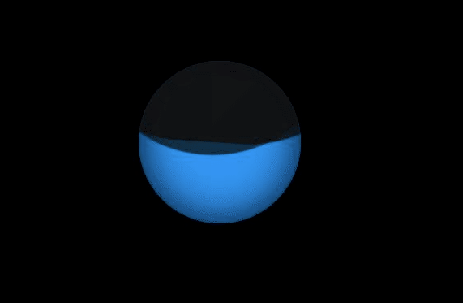
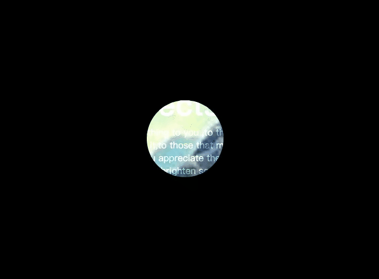
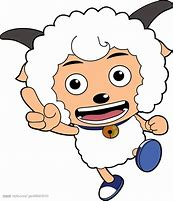
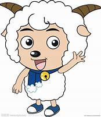
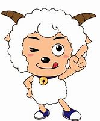
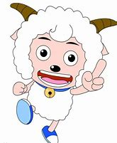
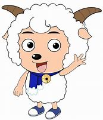
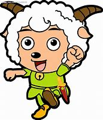
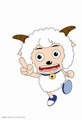

## 液体



```html
<!DOCTYPE html>
<html lang="en">
<head>
  <meta charset="UTF-8" />
  <meta name="viewport" content="width=device-width, initial-scale=1.0" />
  <title>液体流动</title>
</head>
<body>
<div class="loader"></div>

<style>
  * {
    margin: 0;
    padding: 0;
    box-sizing: border-box;
  }
  body {
    display: flex;
    align-items: center;
    justify-content: center;
    min-height: 100vh;
    background: #000;
  }
  .loader {
    position: relative;
    width: 200px;
    height: 200px;
    background: #2196f3;
    border-radius: 50%;
    box-shadow: inset 0 0 50px #000;
    overflow: hidden;
  }
  .loader::before{
    content:'';
    position:absolute;
    top:-150%;
    left:-50%;
    width:200%;
    height: 200%;
    border-radius: 40%;
    background: #111;
    opacity: 0.8;
    animation: animate 12s linear infinite;
  }
  @keyframes animate {
    0%{
      transform:rotate(0deg)
    }
    100%{
      transform:rotate(360deg)
    }
  }

  .loader::after{
    content:'';
    position:absolute;
    top:-150%;
    left:-50%;
    width:200%;
    height: 200%;
    border-radius: 40%;
    background: #111;
    opacity: 0.9;
    animation: animate2 5s linear infinite;
  }
  @keyframes animate2 {
    0%{
      transform:rotate(0deg)
    }
    100%{
      transform:rotate(360deg)
    }
  }
</style>
</body>
</html>
```


## 刮刮乐


```html
<!DOCTYPE html>
<html lang="en">
<head>
  <meta charset="UTF-8"/>
  <meta name="viewport" content="width=device-width, initial-scale=1.0"/>
  <title>刮刮乐</title>
</head>
<body>

<div id="scratch"></div>

<style>
  #scratch {
    position: absolute;
    width: 100%;
    height: 100vh;
  }

  img {
    transform: translate(-50%, -50%);

    left: 50%;
    top: 50%;
    width: initial !important;
    height: initial !important;
  }
</style>

<script src="https://lib.baomitu.com/jquery/3.5.0/jquery.js"></script>
<script src="../js/wScratchPad.js"></script>
<script>
  $('#scratch').wScratchPad({
    size: 50,          // The size of the brush/scratch.
    bg: 'https://tse1-mm.cn.bing.net/th/id/OIP.GVME6Vw-3Xi5pUBLKNYpmQHaCO?w=299&h=104&c=7&o=5&pid=1.7',  // Background (image path or hex color).
    fg: '#000',  // Foreground (image path or hex color).
  });
</script>
</body>
</html>
```


## 放大镜



```html
<!DOCTYPE html>
<html lang="en">
<head>
  <meta charset="UTF-8"/>
  <meta name="viewport" content="width=device-width, initial-scale=1.0"/>
  <title>放大镜</title>
</head>
<body>

<div class="banner">

</div>
<div class="content">
  <h2>CSS Clip-path Effects</h2>
  <p>
    Please send this message to those people who mean something to you ,to those who have touched
    your life in one way or another,to those who make you smile when you really need it,to those
    that make you see the brighter side of things when you are really down,to those who you want to
    let them know that you appreciate their friendship.And if you don't,don't worry,nothing bad
    will happen to you,you will just miss out on the opportunity to brighten someone's day with the
    message.Please send this message to those people who mean something to you,to those who have
    touched your life in one way or another.
  </p>
</div>
<style>
  * {
    margin: 0;
    padding: 0;
  }

  body {
    display: flex;
    align-items: center;
    justify-content: center;
    min-height: 100vh;
    background: #000;
  }

  .banner {
    position: fixed;
    width: 100%;
    height: 100vh;
    background: url("https://tse2-mm.cn.bing.net/th/id/OIP.oGjZ9HDV3jr9IKjUZcu6GAHaEo?w=288&h=180&c=7&o=5&pid=1.7");
    background-size: cover;
    display: flex;
    align-items: center;
    justify-content: center;
    /*transition: 0.2s;*/
    clip-path: circle(75px at var(--x) var(--y));
  }
  .banner:active{
    clip-path: circle(200px at var(--x) var(--y));
  }

  .content {
    position: relative;
    max-width: 1100px;
    z-index: 1;
    mix-blend-mode: overlay;
    pointer-events: none;
    user-select: none;
  }

  .content h2 {
    position: relative;
    color: #fff;
    font-size: 60px;
  }

  .content p {
    position: relative;
    color: #fff;
    font-size: 18px;
  }
</style>
<script>
  let pos = document.documentElement;
  pos.addEventListener('mousemove', e => {
    pos.style.setProperty('--x', e.clientX + 'px');
    pos.style.setProperty('--y', e.clientY + 'px');
  })
</script>
</body>
</html>
```

## 波浪加载


```html
<!DOCTYPE html>
<html lang="en">
<head>
  <meta charset="UTF-8"/>
  <meta name="viewport" content="width=device-width, initial-scale=1.0"/>
  <title>波浪加载</title>
</head>
<body>
<div class="loader">
  <span></span>
  <span></span>
  <span></span>
  <span></span>
  <span></span>
  <span></span>
  <span></span>
  <span></span>
  <span></span>
  <span></span>
  <span></span>
  <span></span>
  <span></span>
  <span></span>
  <span></span>
</div>

<style>
  * {
    margin: 0;
    padding: 0;
  }

  body {
    display: flex;
    justify-content: center;
    align-items: center;
    min-height: 100vh;
    background: #9c27b0;
  }

  .loader {
    position: relative;
    width: 300px;
    height: 300px;
    transform-style: preserve-3d;
    transform: perspective(500px) rotateX(60deg);

  }

  .loader span {
    position: absolute;
    display: block;
    border: 5px solid #fff;
    box-shadow: 0 5px 0 #ccc, inset 0 5px 0 #ccc;
    box-sizing: border-box;
    border-radius: 50%;
    animation: animate 3s ease-in-out infinite;
  }

  @keyframes animate {
    0%, 100% {
      transform: translateZ(-100px);
    }
    50% {
      transform: translateZ(100px);
    }

  }

  .loader span:nth-child(1) {
    top: 0;
    left: 0;
    bottom: 0;
    right: 0;
    animation-delay: 1.4s;
  }

  .loader span:nth-child(2) {
    top: 10px;
    left: 10px;
    bottom: 10px;
    right: 10px;
    animation-delay: 1.3s;
  }

  .loader span:nth-child(3) {
    top: 20px;
    left: 20px;
    bottom: 20px;
    right: 20px;
    animation-delay: 1.2s;
  }

  .loader span:nth-child(4) {
    top: 30px;
    left: 30px;
    bottom: 30px;
    right: 30px;
    animation-delay: 1.1s;
  }

  .loader span:nth-child(5) {
    top: 40px;
    left: 40px;
    bottom: 40px;
    right: 40px;
    animation-delay: 1s;
  }

  .loader span:nth-child(6) {
    top: 50px;
    left: 50px;
    bottom: 50px;
    right: 50px;
    animation-delay: 0.9s;
  }

  .loader span:nth-child(7) {
    top: 60px;
    left: 60px;
    bottom: 60px;
    right: 60px;
    animation-delay: 0.8s;
  }

  .loader span:nth-child(8) {
    top: 70px;
    left: 70px;
    bottom: 70px;
    right: 70px;
    animation-delay: 0.7s;
  }

  .loader span:nth-child(9) {
    top: 80px;
    left: 80px;
    bottom: 80px;
    right: 80px;
    animation-delay: 0.6s;
  }

  .loader span:nth-child(10) {
    top: 90px;
    left: 90px;
    bottom: 90px;
    right: 90px;
    animation-delay: 0.5s;
  }

  .loader span:nth-child(11) {
    top: 100px;
    left: 100px;
    bottom: 100px;
    right: 100px;
    animation-delay: 0.4s;
  }

  .loader span:nth-child(12) {
    top: 110px;
    left: 110px;
    bottom: 110px;
    right: 110px;
    animation-delay: 0.3s;
  }

  .loader span:nth-child(13) {
    top: 120px;
    left: 120px;
    bottom: 120px;
    right: 120px;
    animation-delay: 0.2s;
  }

  .loader span:nth-child(14) {
    top: 130px;
    left: 130px;
    bottom: 130px;
    right: 130px;
    animation-delay: 0.1s;
  }

  .loader span:nth-child(15) {
    top: 140px;
    left: 140px;
    bottom: 140px;
    right: 140px;
    animation-delay: 0s;
  }
</style>
</body>
</html>
```

## 瀑布布局


```html
<!DOCTYPE html>
<html lang="en">
<head>
  <meta charset="UTF-8"/>
  <meta name="viewport" content="width=device-width, initial-scale=1.0"/>
  <title>瀑布布局</title>
  <style>
    * {
      margin: 0;
      padding: 0;
      box-sizing: border-box;
      font-family: '微软雅黑', sans-serif;
    }

    body {
      display: flex;
      align-items: center;
      justify-content: center;
      min-height: 100vh;
      background: #222;
    }

    body img {
      max-width: 128px;
    }

    .container {
      position: relative;
      max-width: 100%;
      display: grid;
      grid-template-columns: repeat(auto-fill, minmax(300px, 1fr));
      grid-template-rows: minmax(100px, auto);
      grid-auto-flow: dense;
      margin: 40px;
      grid-gap: 10px;
    }

    .container .box {
      background: #333;
      padding: 20px;
      display: grid;
      font-size: 20px;
      place-items: center;
      text-align: center;
      color: #fff;
      transition: 0.5s;

    }

    .container .box img {
      position: relative;
      max-width: 100px;
      margin-bottom: 10px;
    }

    .container .box:nth-child(1) {
      grid-column: span 2;
      grid-row: span 1;
    }

    .container .box:nth-child(2) {
      grid-column: span 1;
      grid-row: span 2;
    }

    .container .box:nth-child(4) {
      grid-column: span 1;
      grid-row: span 2;
    }

    .container .box:nth-child(5) {
      grid-column: span 3;
      grid-row: span 2;
    }

    @media (max-width: 991px) {
      .container {
        grid-template-columns: repeat(auto-fill, minmax(50%, 1fr));
        grid-template-rows: minmax(auto, auto);
      }
      .container .box{
        grid-column: unset !important;
        grid-row: unset !important;
      }

    }
  </style>
</head>
<body>
<div class="container">
  <div class="box">
    <p>接触动物和动物产品后，要用肥皂和水洗手</p>
  </div>
  <div class="box">
    <p>咳嗽和打喷嚏时，用弯曲的肘部和纸巾捂住口鼻</p>
  </div>
  <div class="box">
    <p>如果发烧和咳嗽，避免旅行</p>
  </div>
  <div class="box">
    <p>如果发烧，咳嗽和呼吸困哪，请尽早就医</p>
  </div>
  <div class="box">
    <p>如果您咳嗽或打喷嚏，请戴上口罩，并且必须知道如何使用并妥善处理</p>
  </div>
  <div class="box">
    <p>只吃煮熟的食物</p>
  </div>
  <div class="box">
    <p>避免与生病的动物密切接触</p>
  </div>
</div>

</body>
</html>
```


