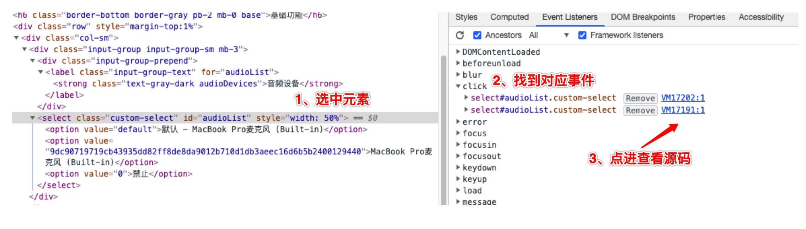
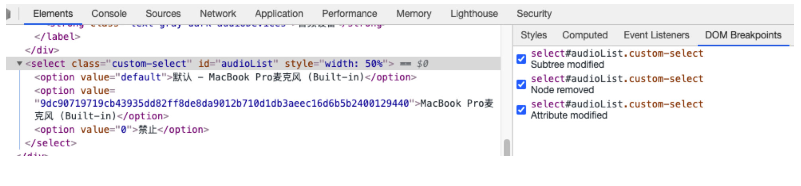

# 断点调试
## 1. 直接在源代码中打断点
## 2. 通过元素事件找到源代码打断点



## 3. 找到元素打dom断点


## 4. 通过MutationObserver打断点，查看调用栈
```javascript
//要观察的节点
let node = document.querySelector('#select');
let observer = new MutationObserver((...args) => {
    debugger;
    console.log(args);
});
observer.observe(node, {
    childList: true,  // 观察目标子节点的变化，是否有添加或者删除
    attributes: true, // 观察属性变动
    subtree: true,     // 观察后代节点，默认为 false
});
```
